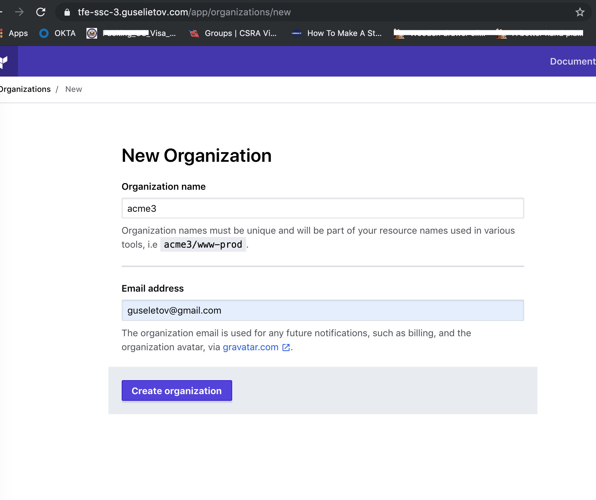
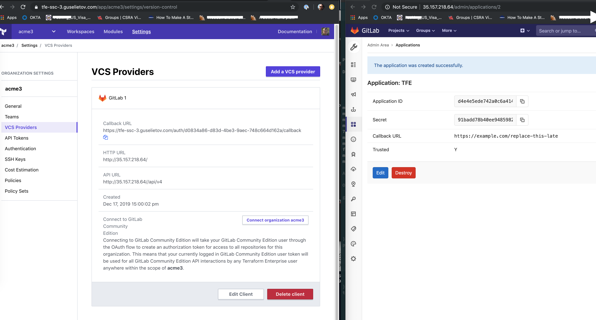
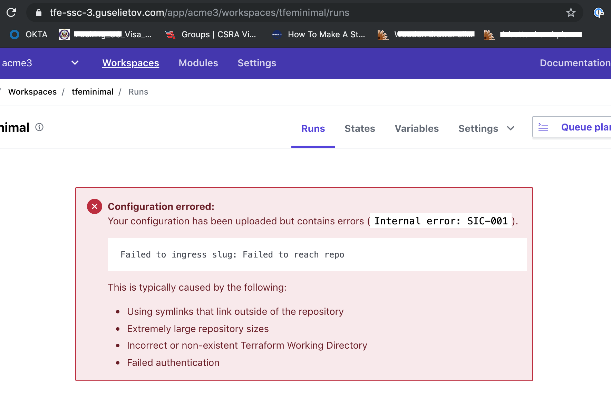

# tfe-selfsigned-with-proxy
Choose one install you feel comfortable with, and use proxy and git (gitlab or bitbucket) all with self-signed SSL cert
LB can be on real certificate.

Based on: https://github.com/Galser/ptfe-prodmount-vc-cloud-backuprestore

# Purpose

This repo contains all the code and instructions on how to install a TFE (Prod) version with a Self-Signed Certificate in an AWS cloud environment in diskmount mode with a proxy in front of it and later, how to setup and test VCS connection. 

# Requirements

This repository assumes general knowledge about Terraform, if not, please get yourself accustomed first by going through [getting started guide for Terraform](https://learn.hashicorp.com/terraform?track=getting-started#getting-started). We also going to use AWS EC2 as our infrastructure provider, DNS service of CloudFlare.

To learn more about the mentioned above tools and technologies - please check section [Technologies near the end of the README](#technologies)


# How-to

## Prepare authentication credentials
- Beforehand, you will need to have SSH RSA key available at the default location :
 - `~/.ssh/id_rsa` and `~/.ssh/id_rsa.pub`
 > This key is going to be used later to connect to the instance where TFE will be running.
 
- Prepare AWS auth credentials (You can create security credentials on [this page](https://console.aws.amazon.com/iam/home?#security_credential).) To export them via env variables, execute in the command line :
 ```
 export AWS_ACCESS_KEY_ID="YOUR ACCESS KEY"
 export AWS_SECRET_ACCESS_KEY="YOUR SECRET KEY"
 ```
- Prepare CloudFlare authentication for your domain DNS management - register and export as env variables API keys and tokens. Follow instructions from CloudFlare here: https://support.cloudflare.com/hc/en-us/articles/200167836-Managing-API-Tokens-and-Keys
 - Export generated token and API keys :
 ```bash
 export CLOUDFLARE_API_KEY=YOUR_API_KEY_HERE
 export CLOUDFLARE_API_TOKEN=YOUR_TOKEN_HERE
 export CLOUDFLARE_ZONE_API_TOKEN=YOUR_TOKEN_HERE
 export CLOUDFLARE_DNS_API_TOKEN=YOUR_TOKEN_HERE
 ```

## Deploy infrastructure
- Clone this repo (*use the tools of your choice*)
- Open the folder with cloned repo
- Define your domain name in [variables.tf](variables.tf), edit on 2-nd line, following block :
 ```terraform
 variable "site_domain" {
   default = "guselietov.com"
 }
 ```
- Define your domain site (host) record in [variables.tf](variables.tf), edit on 6-s line, following block :
 ```terraform
 variable "site_record" {
   default = "tfe-ssc-3"
 }
 ```

- From inside folder with cloned repo `init Terraform` by executing :
```
terraform init
```
Example output can be found here : [terraform_init.md](terraform_init.md)

- Now let's spin up everything, by executing :
```
terraform apply -auto-approve
```
Example FULL output can be found here : [terraform_apply.md](terraform_apply.md)

Execution will take some time, and at the very end of the output you should see something similar to :
```bash
Outputs:

gitlab = {
  "gitlab_fqdn" = "tfe-ssc-3-gitlab.guselietov.com"
  "gitlab_private_ip" = [
    "10.0.1.177",
  ]
  "gitlab_public_ip" = [
    "35.157.218.64",
  ]
}
proxy = {
  "proxy_private_ip" = [
    "10.0.1.66",
  ]
  "proxy_public_ip" = [
    "18.194.28.150",
  ]
}
tfe_data = {
  "backend_fqdn" = "tfe-ssc-3_backend.guselietov.com"
  "full_site_url" = "tfe-ssc-3.guselietov.com"
  "loadbalancer_fqdn" = "ag-clb-ag-clb-tfe-ssc-3-177845966.eu-central-1.elb.amazonaws.com"
  "tfe_instance_public_ip" = "3.122.205.219"
}
```

We have the infrastructure and most of the required software ready, now let's proceed to the next section and install TFE

## Install TFE

### Terminal-based portion of TFE installation

- Connect to VM :
```bash
ssh ubuntu@tfe-ssc-3_backend.guselietov.com
```
> Note: Use the `public_ip` or `backend_fqdn` from the previous step

- We want to ensure usage of the proxy from the very beginning. So instead of one-liner that downloads and runs installation script, we are going to do two steps: 

  - Download installation script by executing : 
  ```
  curl https://install.terraform.io/ptfe/stable  > install.sh
  ```
  - Run it with specifying proxy parameter, the IP-address of the proxy can be found in the output section of `terraform apply` above - `proxy_private_ip`. Execute : 
```
sudo bash ./install.sh http-proxy=http://10.0.1.66:3128
```

 - use Public IP-address from previous steps ( `3.122.205.219` in the example ) for the service question. You can just press [Enter],
 
 Output example :
 ```bash
   % Total    % Received % Xferd  Average Speed   Time    Time     Time  Current
                                 Dload  Upload   Total   Spent    Left  Speed
100  133k  100  133k    0     0  30975      0  0:00:04  0:00:04 --:--:-- 30975
Determining local address
The installer will use network interface 'ens5' (with IP address '10.0.1.67')
Determining service address
The installer will use service address '3.122.205.219' (discovered from EC2 metadata service)
The installer has automatically detected the service IP address of this machine as 3.122.205.219.
Do you want to:
[0] default: use 3.122.205.219
[1] enter new address...
...

 Operator installation successful

 To continue the installation, visit the following URL in your browser:

 http://3.122.205.219:8800

 ```
This concludes the terminal install portion. Let's continue in Web UI.

### Web-based portion of TFE installation

- Open your favorite browser and access the link that had been presented to you at the previous step: http://3.122.205.219:8800,  As we using self-signed certificates for this part of the installation, you will see a security warning when first connecting. **This is expected and you'll need to proceed with the connection anyway.**
- Now you will be presented with settings screen where you will need to enter hostname: `tfe-ssc-3.guselietov.com` *( this used in the example, you may have another one if you modified settings earlier)* and press button **[Use Self-Signed Cert]**

   > Sometimes, depending on the speed of instance connection and external resources replies you will fail to access this screen because load-balancer could not detect that Terraform Dashboard already running and removed it from service. Just wait 30 seconds and refresh the page.
- In the next step - you need to give your license file. Usually, it comes in a special tar-ball package with extension RLI. Press **[Choose license]**, Locate the file and upload.
- The next screen allows you to select between *Online* and *air-gapped* installation. Choose **[Online]** and press **[Continue]** button
- At the next step, you will need to enter the password, that can be used in the future to access THIS, Admin Console. Enter the desired password, and press **[continue]**
- Now you will see the *"Preflight Checks"* when all the main requirements for the PTFE installation checked and the one that passed marked with a green checkmark. They ALL should be green to pass.
Once more, press **[Continue]** button
- The next screen presents all your settings in one place
    - Check that host FQDN is correct
    - Scroll down to the *Installation Type* section and select **[Production]**
    - Now in the next section *Production Type* select **[Mounted Disk]**
    - Below it, in the *Mounted Disk Configuration* enter path : `/tfe-data`

    Consult the screenshot for guidance :

    
   After that - press **[Save]** button at the bottom of the page to save all your settings. And you going to be present with the following informational screen :

 Press **[Restart Now]**
- At this moment PTFE will do a full start of all internal services, it can take a couple of minutes, refresh the window from time to time :

  > Note:..Depending on your browser and/or browser settings the starting in the left part of Dashboard - never changes unless you reload the page. So force-reload the page after 2-3 minutes.
- While TFE starting, please access the top-right menu with settings, "Console Settings" item. In the opened page, find section *Snapshot & Restore*. In the filed **"Snapshot File Destination"** enter : `/tfe-snapshots`.
Press blue **[Save]** button at the bottom of the page.
- You can double-check that proxy is used in the section "HTTP Proxy" : 

    

- Return to the dashboard. Wait a couple of minutes for the state in the left rectangle to be changed to **Started**. Now, below the button **[Stop now]** there is link **[Open]** :

    

    Open it. This will lead you to the first-time setup of the admin user :
- Set up your admin user :

    

    Fill in the form and press **[Create an account]**
- Now you are logged in the brand fresh Terraform Enterprise. Congratulations. You can check over the next section on how to test it.

## Finalize GitLab configuration

- Use the FQDN of GitLab from output or `public_ip` and point your browser to it. On your first visit, you'll be redirected to a password reset screen. Provide the password for the initial administrator account and you will be redirected back to the login screen. Use the default account's username root to login.

> GitLab for our use-case had been installed using the Omnibus package. If you want more details or tune something in the configuration - check this detailed manual: https://docs.gitlab.com/omnibus/README.html#installation-and-configuration-using-omnibus-package 


## Configure workspace and attach VCS

Back to TFE.

- After the first login, you will need to create organizations as there is none at the start : 


- Press **"Create New Organizations"**, for this example, we going to enter the name "acme3", feel free to use your name and email : 



- Now, we are going to connect VCS as a separate step. 
  - Go to our GitLab instance and log in with the admin level account. 

  > Important: The account you use for connecting Terraform Enterprise must have admin (master) access to any shared repositories of Terraform configurations since creating webhooks requires admin permissions. Do not create the application as an administrative application not owned by a user; Terraform Enterprise needs user access to repositories to create webhooks and ingress configurations.

  - Navigate to GitLab's "User Settings > Applications" page.

  This page is located at https://**GITLAB INSTANCE HOSTNAME**/profile/applications. 
  You can also reach it through GitLab's menus:
    - In the upper right corner, click your profile picture and choose "Settings."
    - In the navigation sidebar, click "Applications."
  
  - This page has a list of applications and a form for adding new ones. Press green button **"Add application"** : 


- The form will appear, it has two text fields and some checkboxes : 


Fill it up : 

| Field            | Value |
|---------------|-------|
| checkbox *API* |    set |
| Name            | Terraform Enterprise (**YOUR ORGANIZATION NAME**) |
| Redirect URI    | https://example.com/replace-this-later (or any placeholder; the correct URI doesn't exist until the next step.) |

- Click the **"Save application"** button, which creates the application and takes you to its page : 


- Leave this page open in a browser tab. In the next step, you will copy and paste the unique Application ID and Secret.

- Go back to our TFE in the browser, we stopped at the organization creation, there should be "Add VCS Provide" button available right now, click it. 

The next page has a drop-down and four text fields. Select "GitLab Community Edition" from the drop-down, and fill in all four text fields as follows:

| Field            | Value |
|---------------|-------|
| HTTP URL    | https://**GITLAB INSTANCE HOSTNAME** |
| API URL    | https://**GITLAB INSTANCE HOSTNAME**/api/v4 |
| Application ID    | (paste value from the previous step) |
| Secret    | (paste value from the previous step) |

- Click "Create connection." This will take you back to the VCS Provider page, which now includes your new GitLab client : 



Locate the new client's "Callback URL," and copy it to your clipboard; you'll paste it in the next step. Leave this page open in a browser tab.

- Go back to your GitLab browser tab. (If you accidentally closed it, you can reach your OAuth app page through the menus: use the upper right menu > Settings > Applications > "Terraform Enterprise (<YOUR ORG NAME>)".)

- Click the "Edit" button.

- In the "Redirect URI" field, paste the callback URL from Terraform Enterprise's VCS Provider page, replacing the "example.com" placeholder you entered earlier.

- Click the "Save application" button. A banner saying the update succeeded should appear at the top of the page.

- Go back to your Terraform Enterprise browser tab and click the "Connect organization <NAME>" button on the VCS Provider page.

- This takes you to a page on GitLab, asking whether you want to authorize the app.

- Click the green "Authorize" button at the bottom of the authorization page. This returns you to Terraform Enterprise's VCS Provider page, where the GitLab client's information has been updated.

> If this results in a 500 error, it usually means Terraform Enterprise was unable to reach your GitLab instance.

- Successful authorization going to end up with a small banner at the bottom of the page in TFE : 


## Test commits

- First, we need to create a project in GitLab. To create a project in GitLab:

- In your dashboard, click the green New project button or use the plus icon in the navigation bar. This opens the New project page.

On the New Project page, choose :
 - Create a blank project.
 - On the Blank project tab, provide the following information:
    - The name of your project in the Project name field. You can’t use special characters, but you can use spaces, hyphens, underscores or even emoji.
    - The Project description (optional) field enables you to enter a description for your project’s dashboard, which will help others understand what your project is about. Though it’s not required, it’s a good idea to fill this in.
    - Changing the Visibility Level modifies the project’s viewing and access rights for users.
    - Selecting the Initialize repository with a README option creates a README file so that the Git repository is initialized, has a default branch, and can be cloned.
  - Click Create project.

Consult with screenshot for guidelines 

> note that in the screenshot we accessing project via IP address, that's why you can see Project URL, not as symbolic FQDN


- Add user SSH key (the one you can use for committing, but also for access to the future code from TFE). Visit URL http://tfe-ssc-3-gitlab.guselietov.com/profile/keys  ( in this case I am using URL from initial T~F output )  and add your SSH key : 


- Upload some valid TF code to the freshly created project repository, for this  demo we are going to use file [examples/main.tf](examples/main.tf) : 


- Commit it to the repo

- Return to the TFE; we have organization now connected to the VCS, so continue in the same Tab and page - to  create  `Workspace` for that organization, choose our fresh repo ( **tfeminimal** in the demo ) : 


- Finish workspace creation. Press button **"Create workspace"** 


- Go to the workspace settings and ensure that they are corresponding to the screenshot below :
  - Execution mode set to `Remote`
  - Apply Method is `Auto apply`


- Add your SSH key to the workspace. Click on **Workspace Settings** --> **Manage SSH Keys** - and add one (same as on GitLab side). Or you can add it per connection - choose the method you most comfortable with. 

- Now. Go back to GitLab WebUI or use your favorite Git client. We need to introduce some changes to our TF code in repo.   Change for example name of the `null_resource` on line 14 and commit it to the repo : 

```terraform
...
resource "null_resource" "timed-hello-CHANGED" {
  triggers = {
    timey = "${timestamp()}"
  }
...
```

- Return to the TFE Workspace's Run page and observe results of your commit planning and applying : 


Below, as you can see in the text in the screenshot - until you have proper DNS resolution and hostname on GitLab side, the webhook can fail, for example with such error : 



While in the Atlas logs we can discover following clear message : 
```bash
/app/logs/ptfe_atlas.stdout:2019-12-17T16:58:21.568779062Z 2019-12-17 16:58:21 [INFO] [e4a0f390-212b-4c02-b82d-76c261df7455] {:external_id=>"cv-x9Kd44cWQwmBjcZZ", :controller=>"SlugIngressController", :success=>"false", :error=>"\"Failed to reach repo\"", :msg=>"Failed to ingress slug: Failed to reach repo"}
```
After fixing DNS, the correct results are as above - successful triggering and applying of the TF code can be achieved. 


This concludes the last section. 

When you satisfied with all your tests - you can destroy the whole infrastructure by executing in the cloned repo folder :
```bash
terraform destroy
```
And answering 'yes' to the question.

Example FULL output of destroy can be found here : [terraform_destroy.md](terraform_destroy.md)

# TODO


# DONE
- [x] define objectives 
- [x] reuse code for compute infra
- [x] import mount disk (EBS) code as a module, test
- [x] create code for self-signed cert generation
- [x] decide on a various proxy. test them - ELB, Nginx, Squid, Oops, etc.
- [x] create code for proxy deploy
- [x] deploy proxy, tweak DNS if required
- [x] install TFE in Prod mode
- [x] return a normal certificate for the proxy - as this is allowed for this task
- [x] go back to Nginx, apparently, SQUID in Ubuntu 18.04 now is a bummer
due to open-SSL not compiled by default
- [x] test with proxy
- [x] connect VCS, make screenshots
- [x] update README for VCS part
- [x] create/import tests for TFE
- [x] test commits of tests against custom VCS, save logs & screenshots
- [x] update README for tests
- [x] update screenshots
- [x] final README update

# Run logs

- terraform init : [terraform_init.md](terraform_init.md)
- terraform apply : [terraform_apply.md](terraform_apply.md)
- terraform destroy  : [terraform_destroy.md](terraform_destroy.md)


# Technologies

1. **To download the content of this repository** you will need **git command-line tools**(recommended) or **Git UI Client**. To install official command-line Git tools please [find here instructions](https://git-scm.com/book/en/v2/Getting-Started-Installing-Git) for various operating systems. 

2. **For managing infrastructure** we using Terraform - open-source infrastructure as a code software tool created by HashiCorp. It enables users to define and provision a data center infrastructure using a high-level configuration language known as Hashicorp Configuration Language, or optionally JSON. More you encouraged to [learn here](https://www.terraform.io).
   - Specifically, we going to use Terraform for creating infrastructure, and install Terraform Enterprise. *TFE Overview* can be found here: https://www.terraform.io/docs/enterprise/index.html
   - Pre-Install checklist: https://www.terraform.io/docs/enterprise/before-installing/index.html

3. **This project for virtualization** uses **AWS EC2** - Amazon Elastic Compute Cloud (Amazon EC2 for short) - a web service that provides secure, resizable compute capacity in the cloud. It is designed to make web-scale cloud computing easier for developers. You can read in details and create a free try-out account if you don't have one here : [Amazon EC2 main page](https://aws.amazon.com/ec2/) 

4. **Cloudflare**, - is an American web infrastructure and website security company, providing content delivery network services, DDoS mitigation, Internet security, and distributed domain name server services. More information can be found here: https://www.cloudflare.com/ 

5. **GitLab Server** -  GitLab is a web-based DevOps lifecycle tool that provides a Git-repository manager providing wiki, issue-tracking, and CI/CD pipeline features, using an open-source license, developed by GitLab Inc. You can check more in details here: https://gitlab.com/
